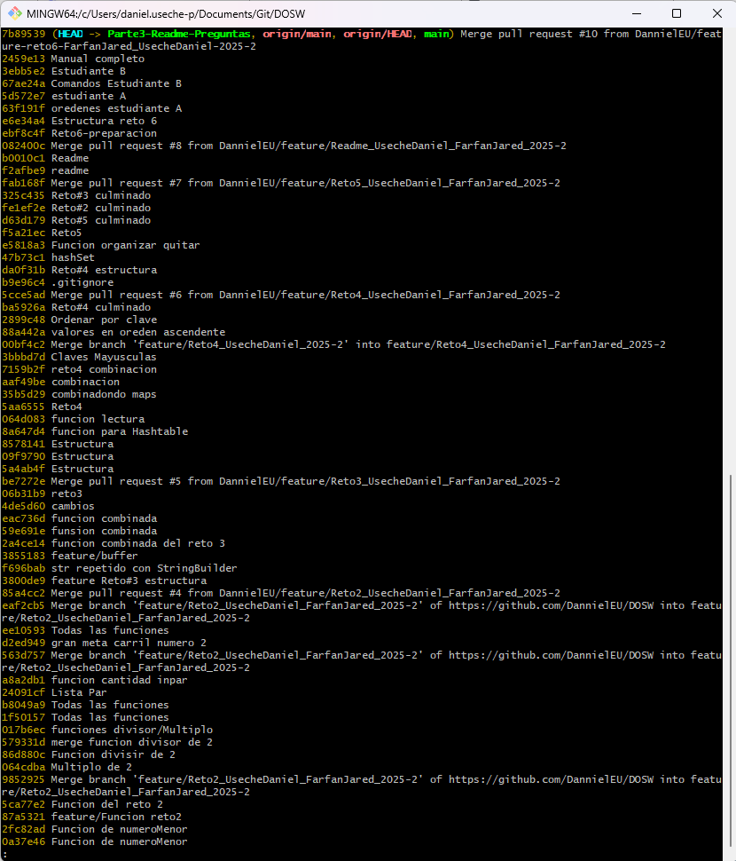
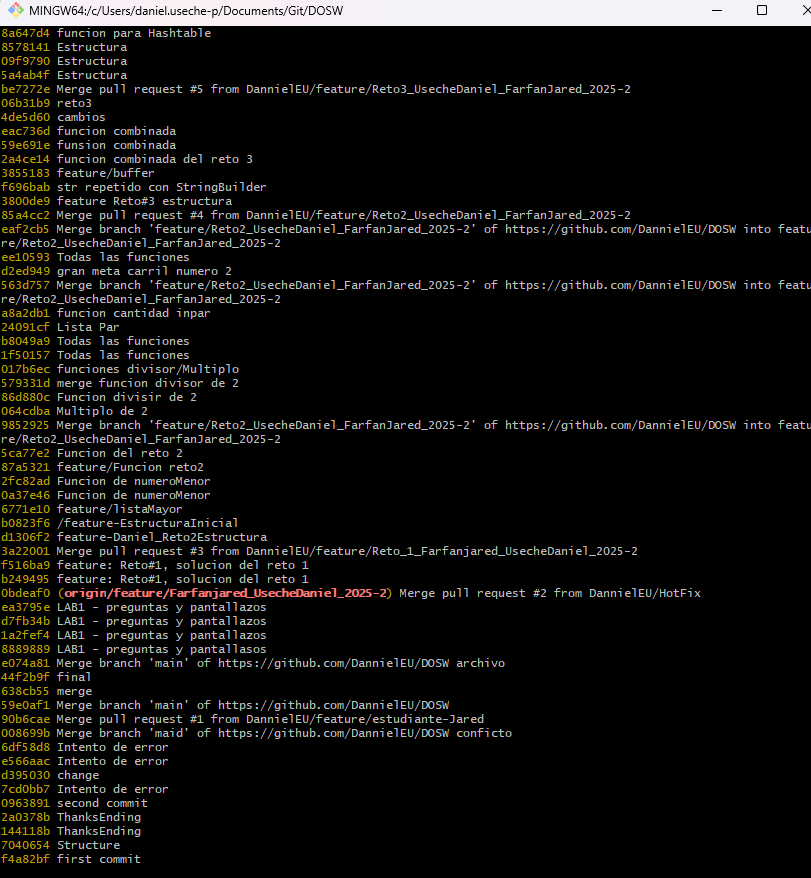
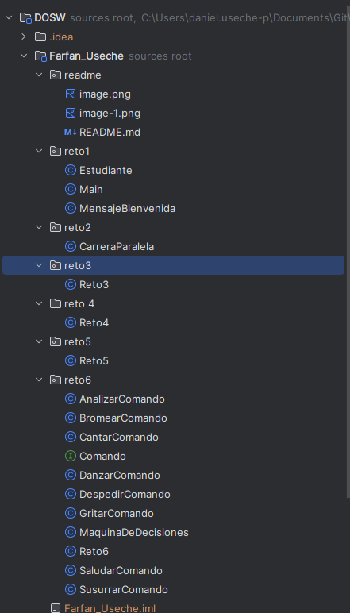

1. **¿Cuál es la diferencia entre `git merge` y `git rebase`?**
   El `merge` une dos ramas creando un commit nuevo que conserva el historial de ambas. En cambio, 
   `rebase` reescribe el historial aplicando los commits de una rama sobre otra como si fueran 
   nuevos, lo que hace que el historial quede más lineal.

2. **Si dos ramas modifican la misma línea de un archivo, ¿qué sucede al hacer `merge`?**
   Va a haber un conflicto. Git no sabe cuál cambio conservar, así que nos toca resolverlo 
   manualmente eligiendo qué versión dejar.

3. **¿Cómo puedes ver gráficamente el historial de `merges` y ramas en consola?**
   Podemos usar `git log --oneline --graph --all --decorate`. Te muestra todo el historial con ramas 
   y merges de forma visual.

4. **Explica la diferencia entre un `commit` y un `push`**
   Un `commit` guarda los cambios localmente en nuestro repo. El `push` envía esos commits al 
   repositorio remoto (como GitHub).

5. **¿Para qué sirve `git stash` y `git pop`?**
   `git stash` guarda cambios que aún no has commiteado para que puedas cambiar de rama sin 
   perderlos. `git pop` los recupera después.

6. **¿Qué diferencia hay entre `HashMap` y `Hashtable`?**
   `HashMap` **no es sincronizado**, o sea que no es seguro en entornos con múltiples hilos, pero es 
   más rápido. `Hashtable` **sí es sincronizado**, pero es más lento. Hoy en día se prefiere usar 
   `HashMap` con sincronización externa si se necesita.

7. **¿Qué ventajas tiene `Collectors.toMap()` frente a un bucle tradicional para llenar un mapa?**
   Es más conciso, legible y funcional. Con streams puedes transformar y recolectar datos en una 
   sola línea sin escribir tanto código repetitivo.

8. **Si usas `List` con objetos y luego aplicas `stream().map()` ¿qué tipo de operación estás haciendo?**
   Una operación de **transformación**. Estás tomando cada elemento de la lista y transformándolo en 
   otro valor u objeto.

9. **¿Qué hace el método `stream().filter()` y qué retorna?**
   Filtra elementos de un stream según una condición. Retorna un **nuevo stream** con los elementos 
   que cumplen esa condición.

10. **Describe el paso a paso de cómo crear una rama desde `develop` si es una funcionalidad nueva.**
    
    Primero me aseguro de estar en `develop`:

```bash
git checkout develop  
git pull  
```

Luego creo la rama:

```bash
git checkout -b feature/nombre-de-la-funcionalidad  
```

Y ya desde ahí empiezo a trabajar.

11. **¿Cuál es la diferencia entre crear una rama con `git branch` y con `git checkout -b`?**
    `git branch` solo crea la rama, pero no te cambia a ella. `git checkout -b` la crea **y te 
    cambia** a esa rama en el mismo paso.

12. **¿Por qué es recomendable crear ramas `feature/` para nuevas funcionalidades en lugar de 
trabajar en `main` directamente?**
    
    Porque así mantenemos el `main` limpio y estable. Si algo falla en la nueva funcionalidad, no 
    afecta el código principal. Además, facilita el trabajo en equipo porque cada quien trabaja en 
    su rama.

Pruebas de trabajo:




Ademas como prueba de trabajo, podemos anexar los pantallaszos de los puntos con sus clases, 
completados.

#Pruebas Puntos 


#Relatos de Taller 1 (Laboratorio 1)

Reto 1: Se crea la clase Estudiante con los atributos nombre, edad, correo y semestre. Luego se 
diseña la clase MensajeBienvenida. Ambos objetos Estudiante se almacenan en una lista. Se implementa 
un stream sobre la lista, utilizando map para transformar la información y collect para construir el 
mensaje de bienvenida que se imprime en consola. Finalmente se documenta la evidencia en el README y 
se hace el commit con el enunciado del reto.

Reto 2: Inicialmente se renombra el archivo a CarreraParalela.java y se hace el commit base en la 
rama feature. Posteriormente, cada estudiante crea una subrama: en carril 1 se implementa una 
función con expresión lambda para calcular el máximo de una lista de enteros, y en carril 2 se 
implementa una función para calcular el mínimo y la cantidad de datos. Se genera un conflicto al 
unificar las funciones con el mismo nombre y se resuelve integrando ambas lógicas en un único 
método. En la segunda iteración se añade en carril 1 la verificación de múltiplo de 2 y en carril 2 
la verificación de divisor de 2. En la tercera vuelta, carril 1 implementa la verificación de 
cantidad par y carril 2 la de cantidad impar. Al final se unifica en un único método que recibe dos 
listas y devuelve un objeto con mayor, menor, cantidad, validaciones de múltiplo/divisor y par/
impar. Se realiza commit y merge de ambas ramas al feature.

Reto 3: Desde la rama feature se crean subramas individuales. En la rama con StringBuilder se 
implementa un método que repite tres veces un mensaje con espacios. En la rama con StringBuffer se 
implementa un método que invierte el texto. En el primer choque ambos métodos se unifican en uno 
solo con el mismo nombre, que repite tres veces y luego invierte. Se resuelven conflictos y se hace 
merge. Se invoca la función con expresión lambda y se procesan repeticiones con stream.

Reto 4: En la primera rama se implementa un método que recibe pares clave-valor y los almacena en un 
HashMap, descartando duplicados. En la segunda rama se implementa lo mismo con Hashtable, 
priorizando sincronización. Luego ambos integran un método que combine HashMap y Hashtable 
priorizando los valores del Hashtable en caso de conflicto. Posteriormente, uno añade la conversión 
de claves a mayúsculas y el otro la ordenación ascendente. Al final se deja una versión unificada 
que convierte claves a mayúsculas, las ordena y combina los dos mapas con Collectors.toMap() y 
lambda.

Reto 5: Se crean métodos en ramas separadas. Con HashSet se almacenan números aleatorios y se 
filtran eliminando múltiplos de 3. Con TreeSet se almacenan números aleatorios ordenados y se 
eliminan múltiplos de 5. En el choque se realiza la unión de ambas colecciones en una estructura 
ordenada, eliminando duplicados. Se emplea stream con filter y se imprime con lambda cada elemento 
del conjunto resultante.

Reto 6: Se implementa un switch-case inicial con los comandos SALUDAR, DESPEDIR, CANTAR y DANZAR. En 
la segunda rama se implementa otro switch-case con los comandos BROMEAR, GRITAR, SUSURRAR y 
ANALIZAR. En el choque se unifican ambos sets de comandos en un único switch-case, resolviendo 
conflictos. Se asocia cada comando a un Runnable en un Map<String, Runnable> utilizando lambdas para 
ejecutar la acción. Finalmente se prueban todos los comandos disponibles.