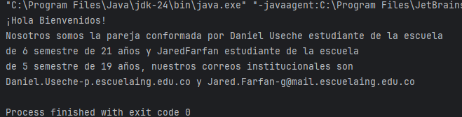
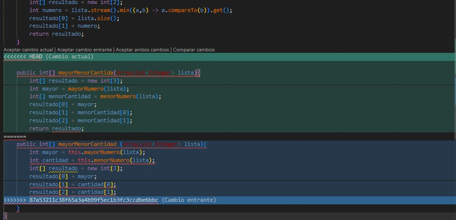
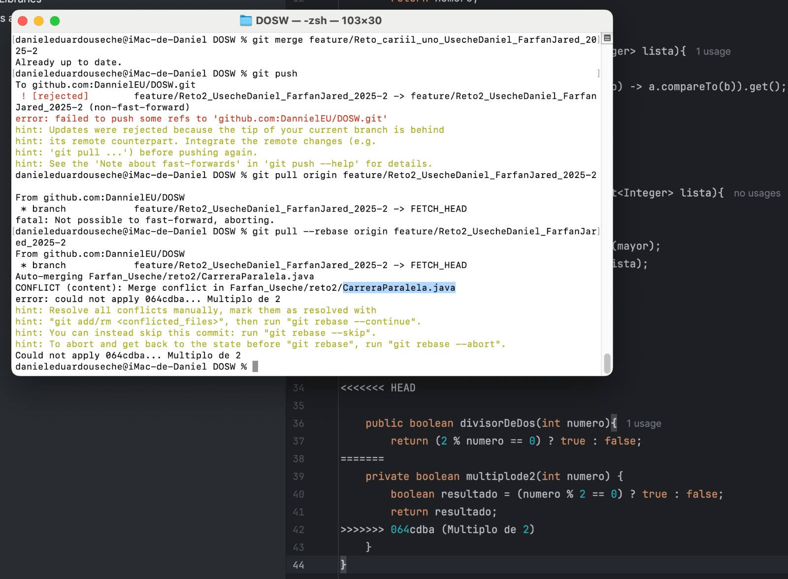
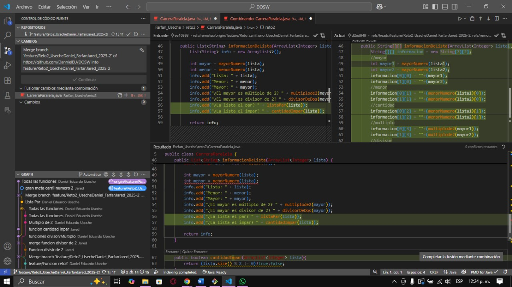
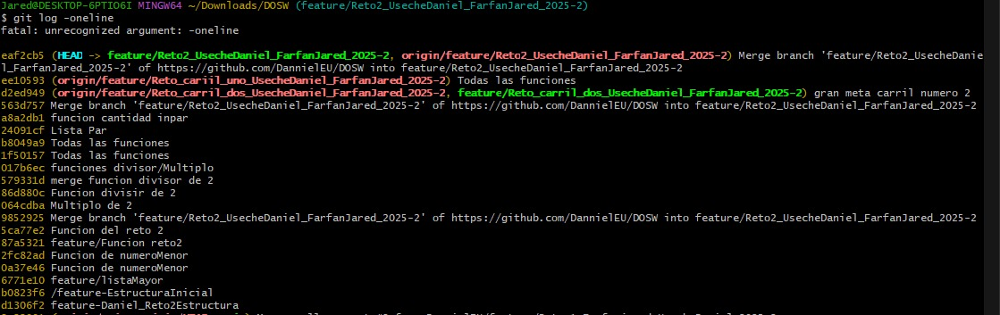
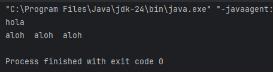
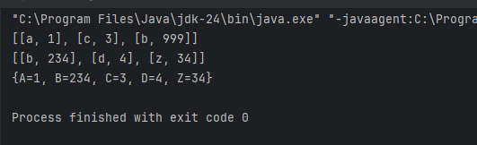
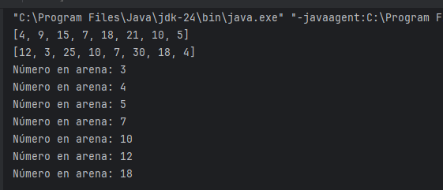

# Maratón Git 2025–2

**Integrantes:**
- Jared Sebsatian Farfan Guevara
- Daniel Eduardo Useche Pinilla

**Nombre de la rama:** 
- feature/Farfanjared_UsecheDaniel_2025-2 (laboratorio)
- mian (taller)

---

# Retos Completados

### Reto 1: La Bienvenida
**Enunciado:**  
Utilizando expresión lambda imprimir un saludo de bienvenida con los nombres de los integrantes de la pareja junto a su edad, correo y semestre.

**Evidencia:**  

**Descripción:**
- Se creó la clase `Estudiante` y `MensajeBienvenida`.
- Se almacenaron los estudiantes en una `List`.
- Se usó `stream()`, `map()` y `collect()` para generar el mensaje.

### Reto 2: Carrera en Paralelo
**Enunciado:**  
Simular una carrera de commits en paralelo en dos carriles (subramas), uno calcula el máximo y otro el mínimo con cantidad de elementos. Luego se combinan y se resuelven conflictos de merge.

**Evidencia:**  

**Descripción:**
- Estudiante A (Carril 2): función para mínimo y cantidad.
- Estudiante B (Carril 1): función para máximo.
- Primer choque: ambos crean una función con mismo nombre que devuelve objeto con máximo, mínimo y cantidad.
- Se resolvieron conflictos en el merge.
- Segunda y tercera vuelta: añadidas verificaciones con if ternario (múltiplo/divisor de 2, par/impar).
- Meta: versión final con objeto `Resultados` que contiene todos los datos.

### Reto 3: El eco misterioso
**Enunciado:**  
Simular una cueva que devuelve eco usando `StringBuilder` (repetir 3 veces) y `StringBuffer` (invertir).

**Evidencia:**  

**Descripción:**
- Estudiante A: método con `StringBuilder` que repite el mensaje 3 veces.
- Estudiante B: método con `StringBuffer` que invierte el mensaje.
- Choque: función combinada que primero repite y luego invierte.
- Se usó `stream()` y `lambda`.

---

### Reto 4: El tesoro de las Llaves duplicadas
**Enunciado:**  
Combinar un `HashMap` y un `Hashtable`, priorizando los valores del `Hashtable` en caso de conflicto, convertir claves a mayúsculas y ordenar en forma ascendente.

**Evidencia:**  

**Descripción:**
- Estudiante A: función con `HashMap` ignorando claves duplicadas.
- Estudiante B: función con `Hashtable`.
- Choque: método con el mismo nombre que combina ambos.
- Resolución de conflicto: se priorizó `Hashtable`.
- Se añadió conversión de claves a mayúsculas (A) y orden ascendente (B).
- Resultado final: combinación usando `Collectors.toMap()` y `sorted()`.

---

### Reto 5: Batalla de Conjuntos
**Enunciado:**  
Un equipo con `HashSet` elimina múltiplos de 3 y otro con `TreeSet` elimina múltiplos de 5. Se unen en una sola colección ordenada sin duplicados.

**Evidencia:**  

**Descripción:**
- Estudiante A: método que usa `HashSet` y filtra múltiplos de 3 con `stream().filter()`.
- Estudiante B: método que usa `TreeSet` y filtra múltiplos de 5.
- Choque: unión de ambos equipos en un `TreeSet` para mantener orden y eliminar duplicados.
- Se imprimió resultado con `lambda`.

---

### Reto 6: (pendiente o completado)
**Evidencia:**  
  
Descripción breve de lo que hicieron.  
